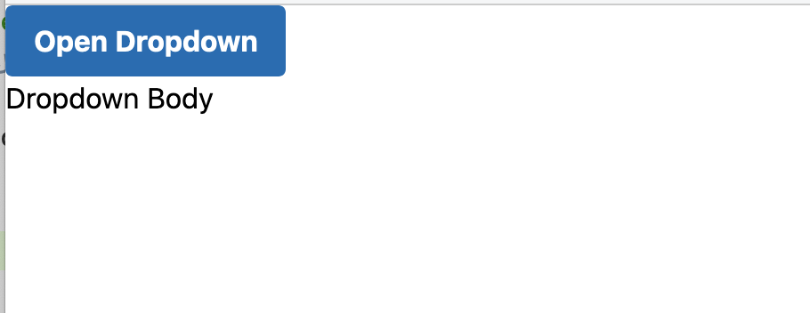

# Matterhorn

Demo using [Tailwind CSS](https://tailwindcss.com/) and [Alpine.js](https://github.com/alpinejs/alpine) in a Rails project.



Rails generated using this command

    rails new matterhorn --skip-keeps --skip-turbolinks -M -C -S -d postgresql --webpacker

Then run

```
bin/rails db:create
bin/rails db:migrate
bin/webpack-dev-server
bin/rails s
```

and navigate to localhost:3000.

Follow this post to see how to configure PostCSS: [Tailwind UI, Tailwind CSS, AlpineJS & Inter Typeface for Ruby on Rails.](https://medium.com/@davidteren/production-ready-tailwind-ui-tailwind-css-alpinejs-inter-typeface-for-ruby-on-rails-part-1-46f24daf1b26)
